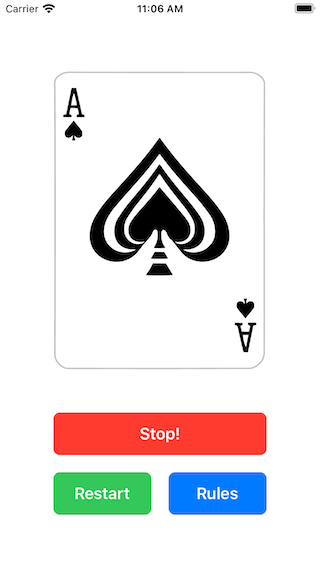
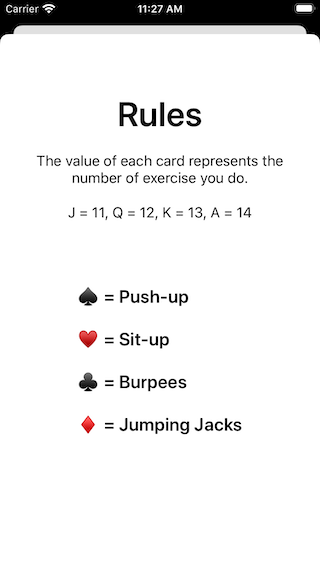
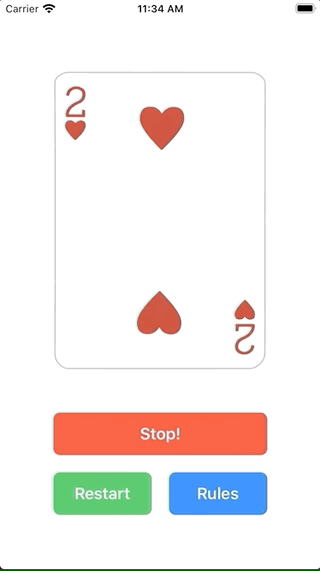

# Card Workout (UIKit-Programmatic)

[](https://opensource.org/licenses/MIT)
[](https://developer.apple.com/xcode/)
[](https://swift.org/blog/)
[](https://developer.apple.com/xcode/interface-builder/)

## Description

Don't you know what to do? well, let the cards to decide for you!

### Notes

This app was created completely programmatically, if you want to see this same app using storyboards, you can go here.

[Card Workout - Storyboard](https://github.com/fdorado985/CardWorkout)

If you are looking for the logic to get the cards from your assets using a loop function instead the static you can copy the gist from here

[Gist: Get All The Cards from Assets](https://gist.github.com/fdorado985/c4615ea211467360d2a24bdb08a347a6)

## Tags

Through these tags you can navigate on each section developed on the app.

### [initial-setup](https://github.com/fdorado985/CardWorkout-Programmatic/tree/initial-setup)

| Screenshot 01 |
| ------------- |
|  |

### [custom-button](https://github.com/fdorado985/CardWorkout-Programmatic/tree/custom-button)

```swift
class CWButton: UIButton {

  // MARK: - View Lifecycle

  init(text: String, backgroundColor: UIColor?) {
    super.init(frame: .zero)
    setTitle(text, for: .normal)
    self.backgroundColor = backgroundColor
    self.titleLabel?.font = .boldSystemFont(ofSize: 19)
    self.layer.cornerRadius = 8
    translatesAutoresizingMaskIntoConstraints = false
  }

  required init?(coder: NSCoder) {
    fatalError("init(coder:) has not been implemented")
  }
}
```

### [card-selection-screen](https://github.com/fdorado985/CardWorkout-Programmatic/tree/card-selection-screen)

| Screenshot 02 |
| ------------- |
|  |

### [rules-screen](https://github.com/fdorado985/CardWorkout-Programmatic/tree/rules-screen)

| Screenshot 03 |
| ------------- |
|  |

### [app-logic](https://github.com/fdorado985/CardWorkout-Programmatic/tree/app-logic)

| Screenshot 04 |
| ------------- |
|  |
